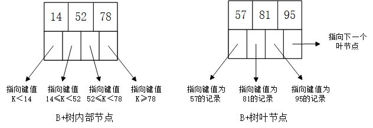
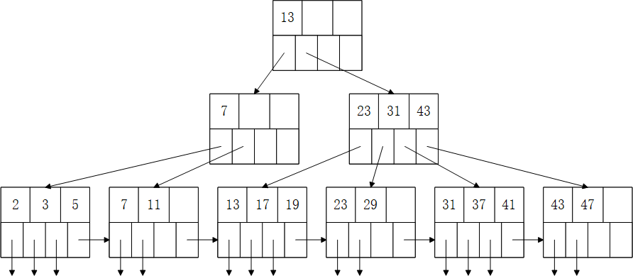
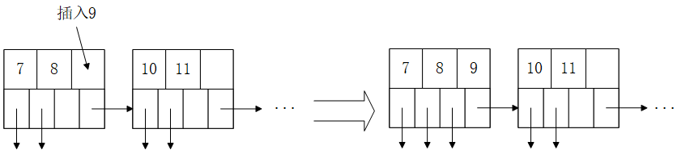
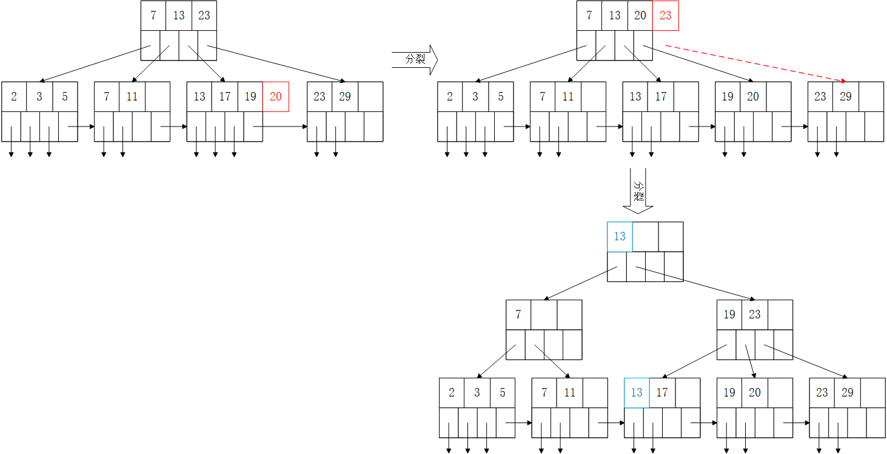
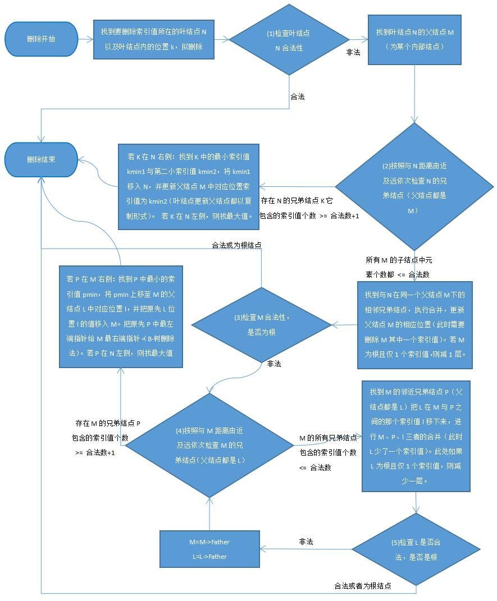
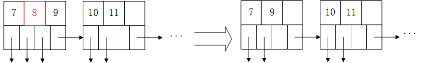
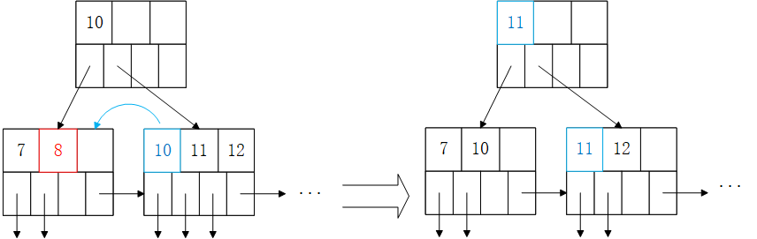
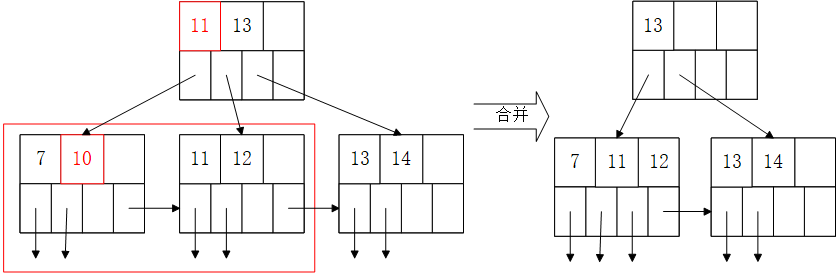
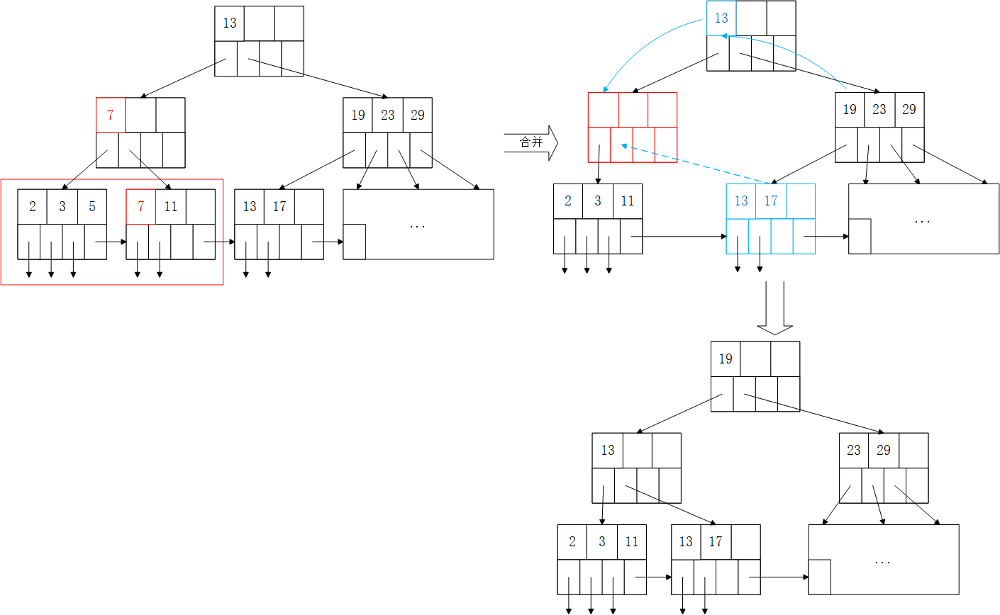
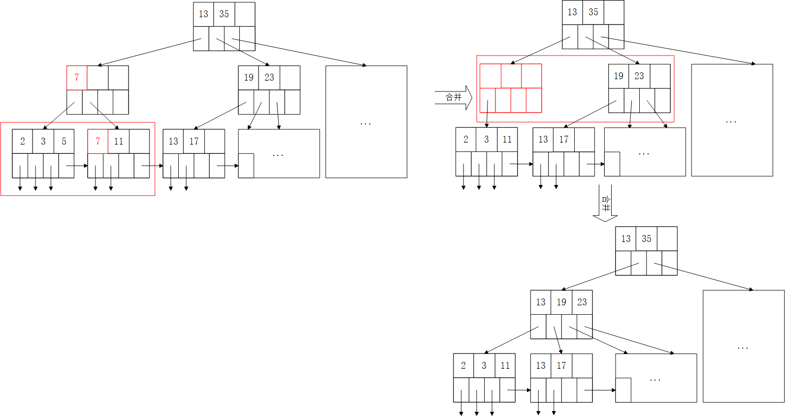

##### 1. B+树介绍

###### 1. B+树定义

首先，我们定义B+树中存放键值的数量为$n$，则每个B+树节点中有 $n$ 个键值与 $n+1$ 个指针，分为两种情况：

1. 叶结点：叶节点在B+树的最底层（所有叶节点都在一层），叶结点中存放**索引值**、**指向记录的指针**、**指向下一个叶结点的指针**。**叶结点内**的索引值是记录中键的拷贝，这些索引值以**排好序**的形式，从左到右分布在叶节点中。存放**指向记录**的指针的装满量必须 >= 一半。 $n+1$ 个指针中，存放记录的指针量为 $n$，剩下1个是指向下一个叶结点的指针，因此当 $n=4$ 时，存放记录的指针个数为2~4时都是合法的。
2. 内部结点：所有非叶结点都属于内部结点，所有内部结点上的索引值都是叶结点的副本。内部结点中存放**索引值**、**指向某一个结点（可以是叶结点也可以是内部节点）的指针**。其中，**存放指针**空间的装满量必须 >= 一半。由于存放指针的数量为 $n+1$ ，则 $n=4$ 时，必须存放3~5个指针才算合法。

B+树的根节点特殊且唯一，其合法性判定与一般的节点不同，分为两种情况：

1. 若树只有一层：仅有根结点，此根结点也是叶结点，根结点中索引值个数无最少限制。
2. 若树为两层以及以上：最上面那一层为根结点，根结点属于内部结点，根节点中指针最少为2个。

如下图为 $n=3$ 时合法叶、内部节点的样例：



一棵合法的B+树的样例（$n=3$）：



###### 2. B+树查找

从根结点开始，首先从结点内部查找（由于结点内部是升序的，二分查找即可）

比如查找4，结点内部存放1,5,8 那么查到5就可以停了，沿着对应的5左边的指针（区间$1\leq x<5$）继续向下查找

直到最后进入叶节点。

若叶节点中存在该索引值，就能找到对应记录的指针，若不存在，则查找失败。

###### 3. B+树插入

B+树的插入流程图如下：


下面举几个例子说明：

1. 只经过 (1) ，即直接插入

   

2. 经过 (1) (2) ，即插入后叶节点分裂

   

3. 经过 (1) (2) (3) ，即插入后不仅叶节点分裂，再上层的内部节点也要分裂

   

(2) (3) 中，红色块表示插入后导致容量超出 $n$ 的键元素，在分裂后，分裂交界处的前一个键上升一层进入父节点中，即图中的蓝色块。

###### 4. B+树删除

B+树的删除比插入更为复杂，流程图如下：



下面举几个例子说明：

1. 只经过 (1) ，即直接删除

   

2. 经过 (1) (2) ，即删除后叶节点不合法，从有余量的兄弟节点“借”一个元素使得合法

   

3. 经过 (1) (2) (3) ，即删除后与兄弟节点合并

   

4. 经过 (1) (2) (3) (4) ，即删除后与兄弟节点合并后，导致父节点不合法，父节点从其兄弟节点中“借”孩子

   

5. 经过 (1) (2) (3) (4) (5) ，即删除后与兄弟节点合并后，导致父节点不合法，父节点与兄弟节点合并

   

###### 5. B+树代码接口

```java
//类声明
//K为索引key的类型，V为值value的类型
+ public class BPTree<K extends Comparable<? super K>, V> {
    //构造函数
    //order为节点中key的最大个数，则中间节点中子节点的最大个数为order + 1，叶子节点中value的最大个数也为order
    + public BPTree(int order);

    //等值查找，此时vector应只有一个元素
    //返回索引key对应的值value，找不到返回空vector
    + public Vector<V> find_eq(K key);

    //不等值查找
    + public Vector<V> find_neq(K key);     // <>
    + public Vector<V> find_leq(K key);     // <=
    + public Vector<V> find_less(K key);    // <
    + public Vector<V> find_geq(K key);     // >=
    + public Vector<V> find_greater(K key); // >

    //插入索引key及其对应的值value，key已存在则抛出异常
    + public void insert(K key, V value) throws IllegalArgumentException;

    //删除索引key及其对应的值，删除失败则抛出异常
    + public void delete(K key) throws IllegalArgumentException;

    //更新索引key对应的值为value，找不到则抛出异常
    + public void update(K key, V value) throws IllegalArgumentException;

    //节点抽象类声明
    + static abstract class Node<K extends Comparable<? super K>, V>;
    //内部结点类声明
    + static class InternalNode<K extends Comparable<? super K>, V> extends Node<K, V>;
    //叶节点类声明
    + static class LeafNode<K extends Comparable<? super K>, V> extends Node<K, V>;
	
    + private Node<K, V> root; //根
    + private int order; //阶数
}
```

